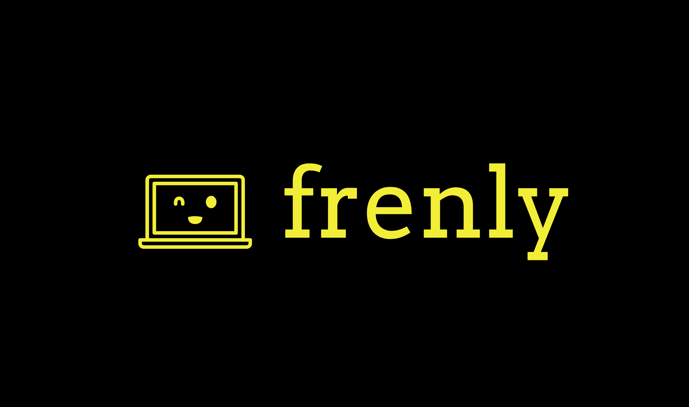

## frenly™ - Building a friendlier web community



#### Problems
The web is just toxic. We want to fix it.

#### Solution
frenly™ is a Chrome extension that ensure covers each aspect. Features as below:

##### 1. Read Post / Comments


##### 2. Write Post / Comments


##### 3. Post / Comment Wrap-Up


Together with all 3 aspects, we hope to create a lightweight, yet 
powerful tool to help build a nicer, friendlier web community.

### Installation
Start the server by running:
```bibtex
pip install -r requirements.txt
python main.py
```
Next, clone and install the companion Chrome extension on your 
computer's Chrome browser. You should now see the frenly™
button on the top right. Enable it and enjoy!

### Team
1. [Tan Hao Hao](https://github.com/gudgud96)
2. [Gary Lai Jun Hong](https://github.com/onwardgary)
3. [Heng Ming Ji](https://github.com/hmingji)
